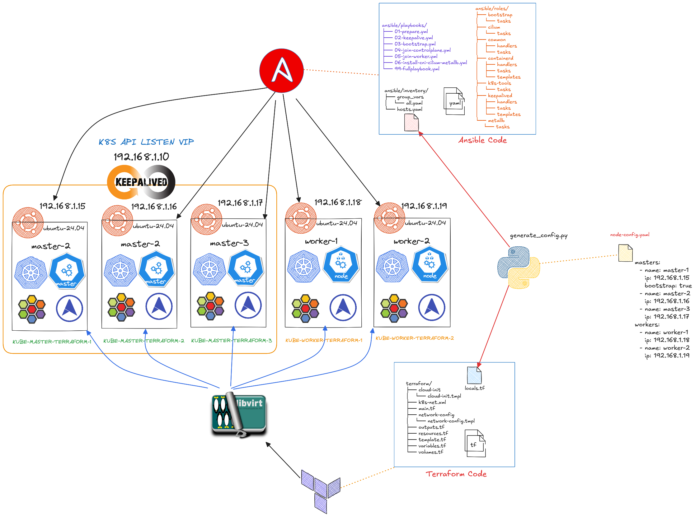

# Reproducible Infrastructure for HA Kubernetes On-premise with Libvirt (Terraform + Ansible)
Setup Overivew


In this repository, I will be making IaC (Infrastructure as Code) configurations for auto-provisioning a **High Availability (HA) Kubernetes Cluster** using:
* **Terraform** and **Libvirt** to provision the virtual machines.
* **Kubeadm** for cluster bootstrapping.
* **Keepalived** and **kube-vip** for Control Plane HA via a Virtual IP (VIP).
* **Cilium** as the Container Network Interface (CNI).
* **MetalLB** for LoadBalancer type services (on-premise).

## 💡 Core Concepts and Technologies (Toggle for Details)

<details>
<summary> **HA Control Plane (Keepalived & kube-vip)**</summary>

For **High Availability (HA)**, all three Kubernetes master nodes must serve the API. This is achieved by using a **Virtual IP (VIP)** address (`192.168.1.10`) that floats between the master nodes.

* **Keepalived** is a routing software that provides a basic HA mechanism by managing the VIP.
* **kube-vip** is a Kubernetes-native tool that integrates with the cluster lifecycle to manage the VIP, ensuring the API server is always reachable even if one master node fails.
* This approach ensures that the **kubelet** on every node points to the single, consistent VIP for API server communication.

</details>

<details>
<summary> **Infrastructure as Code (IaC): Terraform and Libvirt**</summary>

**Terraform** is used as the provisioning tool, utilizing the **Libvirt Provider** to interact with the host machine's hypervisor (KVM/QEMU).

* **Libvirt** acts as the virtualization API layer, managing the lifecycle of the virtual machines (VMs).
* **Terraform** defines the desired state of the VMs (CPU, RAM, network, cloud-init configuration) and uses the Libvirt provider to create them on the host.
* The VMs are attached to a dedicated, bridged Libvirt network (`k8s-net`).

</details>

<details>
<summary> **Configuration Management: Ansible**</summary>

**Ansible** is used for post-provisioning configuration and cluster bootstrapping.

* It handles software installation (**Containerd, Kubeadm, Keepalived**).
* It executes the **`kubeadm init`** command on the first master (bootstrap node).
* It securely **joins** the secondary master and worker nodes to the cluster using generated join tokens.
* It handles the deployment of the CNI (**Cilium**) and the LoadBalancer solution (**MetalLB**).

</details>

<details>
<summary> **Networking Stack: Cilium and MetalLB**</summary>

The cluster utilizes a robust cloud-native networking stack for both pod-to-pod communication and service exposure.

* **Cilium (CNI):** Provides the network overlay for Pod communication, offering advanced features like eBPF-based networking and network policy enforcement.
* **MetalLB (LoadBalancer):** Since this is an on-premise cluster without a native cloud LoadBalancer, MetalLB provides the **`LoadBalancer`** Service type functionality. It assigns external IP addresses from the specified range (`192.168.1.240-250`) to services, making them accessible from the host's network.

</details>

---
## ✨ Key Cluster Configuration Details

| Component | Value | Notes |
| :--- | :--- | :--- |
| **Cluster Size** | 3 Masters, 2 Workers | Total of 5 virtual machines. |
| **Virtual IP (VIP)** | `192.168.1.10` | Used for API Server HA (managed by Keepalived/kube-vip). |
| **Kubernetes Version** | `1.33.0` | Specified in `ansible/inventory/group_vars/all.yaml`. |
| **Cilium Version** | `1.18.0` | Container Network Interface (CNI). |
| **MetalLB IP Range** | `192.168.1.240-250` | Range for LoadBalancer services. |
| **Host Subnet** | `192.168.1.0/24` | Required host network configuration. |

Before trying these in your own machine, please read the requirements and considerations below:
- This Terraform and Ansible IaC configuration assumes you're in a local network with the subnet of **192.168.1.0/24**, and DNS **8.8.8.8**. If the parameters are different, kindly change them in `config/generate_config.py`.
- The host machine uses **Libvirt API**, which Terraform uses to interact with, creating, and managing the virtual machines.
- The Ansible configuration works anywhere, as long as the configuration at `ansible/inventory/group_vars/all.yaml` are properly configured to the correct version.

---


## 🚀 Prerequisites and Host Setup

These steps prepare your host machine (Linux) by installing the necessary virtualization tools (**KVM/Libvirt**), essential utilities, and the required Ansible environment.

### 1. Install System Packages and Core Utilities

```bash
# 1. Update package lists
sudo apt update

# 2. Install KVM, Libvirt, and necessary networking tools
sudo apt install -y qemu-kvm libvirt-daemon-system libvirt-clients bridge-utils

# 3. Install core utilities, Ansible prerequisites, and Python components
sudo apt install -y git wget python3 python3-lxml genisoimage
````

### 2\. Configure Libvirt and User Permissions

Enable the Libvirt service and add your user to the necessary groups (`libvirt` and `kvm`). **You will need to log out and log back in for group changes to take effect.**

```bash
# Enable and start the Libvirt daemon
sudo systemctl enable --now libvirtd
sudo systemctl status libvirtd

# Add user to libvirt and kvm groups (LOGOUT and LOGIN required)
sudo usermod -aG libvirt $USER
sudo usermod -aG kvm $USER

# Verify KVM is operational
kvm-ok
```

### 3\. Setup Ansible Environment

Create a Python virtual environment and install the required Ansible core version and necessary collections.

```bash
## Install Ansible in a virtual environment
python3 -m venv ansible-2.19
source ansible-2.19/bin/activate
pip install --upgrade pip setuptools
pip install ansible-core==2.19.0
pip3 install kubernetes

# Verify Ansible version
ansible --version

# Install required Ansible collections
ansible-galaxy collection install ansible.posix
ansible-galaxy collection install kubernetes.core
ansible-galaxy collection install community.general
ansible-galaxy collection list
```
Command Outputs
```
$ ansible-galaxy collection list

# /home/username/.ansible/collections/ansible_collections
Collection           Version
-------------------- -------
ansible.posix        2.1.0  
community.general    12.0.1 
kubernetes.core      6.2.0  

# /home/username/python-cop/ansible-2.19/lib/python3.11/site-packages/ansible/_internal/ansible_collections
Collection           Version
-------------------- -------
ansible._protomatter 2.19.0 
```
### 4\. Clone Repository and Initial Configuration

```bash
## Clone repo
git clone Knsan1/terraform-ansible-libvirt-k8s-ha.git
cd terraform-ansible-libvirt-k8s-ha

# Check your current IP configuration
ip a
```

### 5\. Setup Libvirt Storage Pool and Base Image

This step installs the base Ubuntu cloud image and imports it into the Libvirt storage pool.

```bash
# Define the pool as a directory type (if not already defined)
sudo virsh pool-define-as default dir --target /var/lib/libvirt/images

# Start default pool
virsh pool-list --all
virsh pool-start default
virsh pool-list --all

# Download the Ubuntu cloud image
wget https://cloud-images.ubuntu.com/jammy/current/jammy-server-cloudimg-amd64.img -O noble-24.04-base.qcow2

# Import the image into Libvirt's default storage pool
virsh vol-create-as default noble-24.04-base.qcow2 10G --format qcow2 --prealloc-metadata
virsh vol-upload --pool default noble-24.04-base.qcow2 noble-24.04-base.qcow2

virsh vol-list --pool default

# Fix permissions on the base image
sudo chown libvirt-qemu:kvm /var/lib/libvirt/images/noble-24.04-base.qcow2
sudo chmod 644 /var/lib/libvirt/images/noble-24.04-base.qcow2
ls -al /var/lib/libvirt/images/noble-24.04-base.qcow2
```
Command Outputs
```
$ virsh pool-list --all
 Name      State    Autostart
-------------------------------
 default   active   no

$ virsh vol-list --pool default
 Name                     Path
--------------------------------------------------------------------------
 noble-24.04-base.qcow2   /var/lib/libvirt/images/noble-24.04-base.qcow2

$ ls -al /var/lib/libvirt/images/noble-24.04-base.qcow2
-rw-r--r-- 1 libvirt-qemu kvm 10739318784 Nov 21 12:50 /var/lib/libvirt/images/noble-24.04-base.qcow2
```

### 6\. Define Libvirt Network for Kubernetes Nodes

Define a dedicated bridged network (`k8s-net`) with NAT, which is necessary for the Terraform configuration to connect the VMs.

```bash
# Create the network definition file
cat <<EOF > k8s-net.xml
<network>
  <name>k8s-net</name>
  <bridge name='virbr1' stp='on' delay='0'/>
  <forward mode='nat'>
    <nat>
      <port start='1024' end='65535'/>
    </nat>
  </forward>
  <ip address='192.168.1.1' netmask='255.255.255.0'>
    <dhcp>
      <range start='192.168.1.100' end='192.168.1.254'/>
    </dhcp>
  </ip>
</network>
EOF

## Create, start, and autostart the network
virsh net-define k8s-net.xml
virsh net-start k8s-net
virsh net-autostart k8s-net
virsh net-list --all
```

-----

## 🛠 Provisioning the Kubernetes Cluster

### Step 1: Define Node Configuration

Define the desired cluster topology by editing the **`node-config.yaml`** file. The configuration should match your 3-master, 2-worker HA setup.

```yaml
# node-config.yaml

masters:
- name: master-1
  ip: 192.168.1.15
  bootstrap: true  # The first node to initialize kubeadm
- name: master-2
  ip: 192.168.1.16
- name: master-3
  ip: 192.168.1.17
workers:
- name: worker-1
  ip: 192.168.1.18
- name: worker-2
  ip: 192.168.1.19
```

  * Define the master and workers **IP** and **name**. These will be used for cloud-init and network configuration.

### Step 2: Generate Configuration Files

Run the Python script to auto-generate the necessary configuration files for Terraform and Ansible.

```bash
python3 config/generate_config.py
```

  * This command will parse `node-config.yaml` and auto-generate `ansible/inventory/hosts.yaml` along with `terraform/locals.tf`.

### Step 3: Provision Virtual Machines with Terraform

Navigate to the `terraform` directory and execute the provisioning. This step creates the VMs using the Libvirt provider.

```bash
cd terraform
terraform plan
terraform apply --auto-approve
virsh list --all
```
Command Outputs
```
virsh list --all
 Id   Name       State
--------------------------
 1    worker-1   running
 2    master-1   running
 3    master-3   running
 4    master-2   running
 5    worker-2   running
```

### Step 4: Configure and Bootstrap Cluster with Ansible

Navigate to the `ansible` directory and run the playbooks sequentially to set up the HA control plane, initialize the cluster, and join all nodes.

```bash
cd ../ansible
# Ping all newly created VMs to ensure connectivity and bypass host key check
ANSIBLE_HOST_KEY_CHECKING=False ansible -i inventory/hosts.yaml all -m ping

# Execute sequential provisioning steps
ansible-playbook playbooks/01-prepare.yml      # Installs common tools, containerd, k8s-tools
ansible-playbook playbooks/02-keepalive.yml     # Deploys Keepalived for VIP HA
ansible-playbook playbooks/03-bootstrap.yml     # Bootstraps the first master (master-1)
ansible-playbook playbooks/04-join-controlplane.yml # Joins secondary masters
ansible-playbook playbooks/05-join-worker.yml   # Joins worker nodes
ansible-playbook playbooks/06-install-cni-cilium-metallb.yml # Deploys Cilium CNI and MetalLB
```
Command Outputs
```
$  ansible -i inventory/hosts.yaml all -m ping
master-3 | SUCCESS => {
    "ansible_facts": {
        "discovered_interpreter_python": "/usr/bin/python3.12"
    },
    "changed": false,
    "ping": "pong"
}
worker-2 | SUCCESS => {
    "ansible_facts": {
        "discovered_interpreter_python": "/usr/bin/python3.12"
    },
    "changed": false,
    "ping": "pong"
}
master-1 | SUCCESS => {
    "ansible_facts": {
        "discovered_interpreter_python": "/usr/bin/python3.12"
    },
    "changed": false,
    "ping": "pong"
}
worker-1 | SUCCESS => {
    "ansible_facts": {
        "discovered_interpreter_python": "/usr/bin/python3.12"
    },
    "changed": false,
    "ping": "pong"
}
master-2 | SUCCESS => {
    "ansible_facts": {
        "discovered_interpreter_python": "/usr/bin/python3.12"
    },
    "changed": false,
    "ping": "pong"
}


$ ansible -m shell -a "hostname;uptime" all
KUBE-WORKER-TERRAFORM-2
 18:39:07 up 32 min,  1 user,  load average: 0.18, 0.61, 0.78
KUBE-MASTER-TERRAFORM-3
 18:39:07 up 32 min,  1 user,  load average: 0.10, 0.93, 1.24
KUBE-WORKER-TERRAFORM-1
 18:39:07 up 32 min,  1 user,  load average: 0.06, 0.49, 0.70
master-2 | CHANGED | rc=0 >>
KUBE-MASTER-TERRAFORM-2
 18:39:07 up 32 min,  1 user,  load average: 0.13, 0.88, 1.16
master-1 | CHANGED | rc=0 >>
KUBE-MASTER-TERRAFORM-1
 18:39:07 up 32 min,  1 user,  load average: 0.22, 1.05, 1.37
```

> **Note:** The optional unified playbook `99-fullplaybook.yml` can be used to run the entire sequence in one command.

-----
### Copy kube config file and accessing k8s cluster
```bash
cp ansible/playbooks/kubeconfig-master-1.yaml ~/.kube/config 
kubectl get nodes -o wide
kubectl get all -A 
```
Command Outputs
```
$ kubectl get nodes -o wide
NAME                      STATUS   ROLES           AGE     VERSION   INTERNAL-IP    EXTERNAL-IP   OS-IMAGE             KERNEL-VERSION     CONTAINER-RUNTIME
kube-master-terraform-1   Ready    control-plane   9m8s    v1.33.0   192.168.1.10   <none>        Ubuntu 24.04.3 LTS   6.8.0-87-generic   containerd://2.1.5
kube-master-terraform-2   Ready    control-plane   7m26s   v1.33.0   192.168.1.16   <none>        Ubuntu 24.04.3 LTS   6.8.0-87-generic   containerd://2.1.5
kube-master-terraform-3   Ready    control-plane   7m35s   v1.33.0   192.168.1.17   <none>        Ubuntu 24.04.3 LTS   6.8.0-87-generic   containerd://2.1.5
kube-worker-terraform-1   Ready    <none>          7m19s   v1.33.0   192.168.1.18   <none>        Ubuntu 24.04.3 LTS   6.8.0-87-generic   containerd://2.1.5
kube-worker-terraform-2   Ready    <none>          7m18s   v1.33.0   192.168.1.19   <none>        Ubuntu 24.04.3 LTS   6.8.0-87-generic   containerd://2.1.5


$ kubectl get all -A
NAMESPACE        NAME                                                  READY   STATUS    RESTARTS        AGE
kube-system      pod/cilium-bv48k                                      1/1     Running   0               7m51s
kube-system      pod/cilium-cqcvt                                      1/1     Running   0               7m51s
kube-system      pod/cilium-envoy-98p26                                1/1     Running   0               7m51s
kube-system      pod/cilium-envoy-gxdpn                                1/1     Running   0               7m51s
kube-system      pod/cilium-envoy-jq226                                1/1     Running   0               7m51s
kube-system      pod/cilium-envoy-s7q79                                1/1     Running   0               7m51s
kube-system      pod/cilium-envoy-tkgkt                                1/1     Running   0               7m51s
kube-system      pod/cilium-lx2pq                                      1/1     Running   0               7m51s
kube-system      pod/cilium-operator-57f989545-w2n7h                   1/1     Running   1 (110s ago)    7m51s
kube-system      pod/cilium-q5q8q                                      1/1     Running   0               7m51s
kube-system      pod/cilium-zbt8t                                      1/1     Running   0               7m51s
kube-system      pod/coredns-674b8bbfcf-bjssq                          1/1     Running   0               9m51s
kube-system      pod/coredns-674b8bbfcf-kwpvv                          1/1     Running   0               9m51s
kube-system      pod/etcd-kube-master-terraform-1                      1/1     Running   0               9m57s
kube-system      pod/etcd-kube-master-terraform-2                      1/1     Running   0               8m14s
kube-system      pod/etcd-kube-master-terraform-3                      1/1     Running   0               8m20s
kube-system      pod/kube-apiserver-kube-master-terraform-1            1/1     Running   1 (5m51s ago)   9m57s
kube-system      pod/kube-apiserver-kube-master-terraform-2            1/1     Running   1 (5m40s ago)   8m14s
kube-system      pod/kube-apiserver-kube-master-terraform-3            1/1     Running   0               8m20s
kube-system      pod/kube-controller-manager-kube-master-terraform-1   1/1     Running   2 (4m20s ago)   9m57s
kube-system      pod/kube-controller-manager-kube-master-terraform-2   1/1     Running   0               8m15s
kube-system      pod/kube-controller-manager-kube-master-terraform-3   1/1     Running   2 (116s ago)    8m20s
kube-system      pod/kube-scheduler-kube-master-terraform-1            1/1     Running   2 (111s ago)    9m57s
kube-system      pod/kube-scheduler-kube-master-terraform-2            1/1     Running   0               8m15s
kube-system      pod/kube-scheduler-kube-master-terraform-3            1/1     Running   1 (4m21s ago)   8m20s
metallb-system   pod/controller-654858564f-sgk9t                       1/1     Running   0               2m32s
metallb-system   pod/speaker-2g72s                                     1/1     Running   1 (65s ago)     2m32s
metallb-system   pod/speaker-8j69f                                     1/1     Running   0               2m32s
metallb-system   pod/speaker-8ntv5                                     1/1     Running   0               2m32s
metallb-system   pod/speaker-wq5zs                                     1/1     Running   0               2m32s
metallb-system   pod/speaker-z6bst                                     1/1     Running   0               2m32s

NAMESPACE        NAME                              TYPE        CLUSTER-IP      EXTERNAL-IP   PORT(S)                  AGE
default          service/kubernetes                ClusterIP   10.96.0.1       <none>        443/TCP                  10m
kube-system      service/cilium-envoy              ClusterIP   None            <none>        9964/TCP                 7m51s
kube-system      service/hubble-peer               ClusterIP   10.101.1.212    <none>        443/TCP                  7m51s
kube-system      service/kube-dns                  ClusterIP   10.96.0.10      <none>        53/UDP,53/TCP,9153/TCP   9m56s
metallb-system   service/metallb-webhook-service   ClusterIP   10.101.33.166   <none>        443/TCP                  2m32s

NAMESPACE        NAME                          DESIRED   CURRENT   READY   UP-TO-DATE   AVAILABLE   NODE SELECTOR            AGE
kube-system      daemonset.apps/cilium         5         5         5       5            5           kubernetes.io/os=linux   7m51s
kube-system      daemonset.apps/cilium-envoy   5         5         5       5            5           kubernetes.io/os=linux   7m51s
metallb-system   daemonset.apps/speaker        5         5         5       5            5           kubernetes.io/os=linux   2m32s

NAMESPACE        NAME                              READY   UP-TO-DATE   AVAILABLE   AGE
kube-system      deployment.apps/cilium-operator   1/1     1            1           7m51s
kube-system      deployment.apps/coredns           2/2     2            2           9m56s
metallb-system   deployment.apps/controller        1/1     1            1           2m32s

NAMESPACE        NAME                                        DESIRED   CURRENT   READY   AGE
kube-system      replicaset.apps/cilium-operator-57f989545   1         1         1       7m51s
kube-system      replicaset.apps/coredns-674b8bbfcf          2         2         2       9m52s
metallb-system   replicaset.apps/controller-654858564f       1         1         1       2m32s
kms@AIXbox:~/python-cop/k8s-terraform-ansible/kubernetes-iac-2404$ kubectl get all -A
NAMESPACE        NAME                                                  READY   STATUS    RESTARTS        AGE
kube-system      pod/cilium-bv48k                                      1/1     Running   0               8m7s
kube-system      pod/cilium-cqcvt                                      1/1     Running   0               8m7s
kube-system      pod/cilium-envoy-98p26                                1/1     Running   0               8m7s
kube-system      pod/cilium-envoy-gxdpn                                1/1     Running   0               8m7s
kube-system      pod/cilium-envoy-jq226                                1/1     Running   0               8m7s
kube-system      pod/cilium-envoy-s7q79                                1/1     Running   0               8m7s
kube-system      pod/cilium-envoy-tkgkt                                1/1     Running   0               8m7s
kube-system      pod/cilium-lx2pq                                      1/1     Running   0               8m7s
kube-system      pod/cilium-operator-57f989545-w2n7h                   1/1     Running   1 (2m6s ago)    8m7s
kube-system      pod/cilium-q5q8q                                      1/1     Running   0               8m7s
kube-system      pod/cilium-zbt8t                                      1/1     Running   0               8m7s
kube-system      pod/coredns-674b8bbfcf-bjssq                          1/1     Running   0               10m
kube-system      pod/coredns-674b8bbfcf-kwpvv                          1/1     Running   0               10m
kube-system      pod/etcd-kube-master-terraform-1                      1/1     Running   0               10m
kube-system      pod/etcd-kube-master-terraform-2                      1/1     Running   0               8m30s
kube-system      pod/etcd-kube-master-terraform-3                      1/1     Running   0               8m36s
kube-system      pod/kube-apiserver-kube-master-terraform-1            1/1     Running   1 (6m7s ago)    10m
kube-system      pod/kube-apiserver-kube-master-terraform-2            1/1     Running   1 (5m56s ago)   8m30s
kube-system      pod/kube-apiserver-kube-master-terraform-3            1/1     Running   0               8m36s
kube-system      pod/kube-controller-manager-kube-master-terraform-1   1/1     Running   2 (4m36s ago)   10m
kube-system      pod/kube-controller-manager-kube-master-terraform-2   1/1     Running   0               8m31s
kube-system      pod/kube-controller-manager-kube-master-terraform-3   1/1     Running   2 (2m12s ago)   8m36s
kube-system      pod/kube-scheduler-kube-master-terraform-1            1/1     Running   2 (2m7s ago)    10m
kube-system      pod/kube-scheduler-kube-master-terraform-2            1/1     Running   0               8m31s
kube-system      pod/kube-scheduler-kube-master-terraform-3            1/1     Running   1 (4m37s ago)   8m36s
metallb-system   pod/controller-654858564f-sgk9t                       1/1     Running   0               2m48s
metallb-system   pod/speaker-2g72s                                     1/1     Running   1 (81s ago)     2m48s
metallb-system   pod/speaker-8j69f                                     1/1     Running   0               2m48s
metallb-system   pod/speaker-8ntv5                                     1/1     Running   0               2m48s
metallb-system   pod/speaker-wq5zs                                     1/1     Running   0               2m48s
metallb-system   pod/speaker-z6bst                                     1/1     Running   0               2m48s

NAMESPACE        NAME                              TYPE        CLUSTER-IP      EXTERNAL-IP   PORT(S)                  AGE
default          service/kubernetes                ClusterIP   10.96.0.1       <none>        443/TCP                  10m
kube-system      service/cilium-envoy              ClusterIP   None            <none>        9964/TCP                 8m7s
kube-system      service/hubble-peer               ClusterIP   10.101.1.212    <none>        443/TCP                  8m7s
kube-system      service/kube-dns                  ClusterIP   10.96.0.10      <none>        53/UDP,53/TCP,9153/TCP   10m
metallb-system   service/metallb-webhook-service   ClusterIP   10.101.33.166   <none>        443/TCP                  2m48s

NAMESPACE        NAME                          DESIRED   CURRENT   READY   UP-TO-DATE   AVAILABLE   NODE SELECTOR            AGE
kube-system      daemonset.apps/cilium         5         5         5       5            5           kubernetes.io/os=linux   8m7s
kube-system      daemonset.apps/cilium-envoy   5         5         5       5            5           kubernetes.io/os=linux   8m7s
metallb-system   daemonset.apps/speaker        5         5         5       5            5           kubernetes.io/os=linux   2m48s

NAMESPACE        NAME                              READY   UP-TO-DATE   AVAILABLE   AGE
kube-system      deployment.apps/cilium-operator   1/1     1            1           8m7s
kube-system      deployment.apps/coredns           2/2     2            2           10m
metallb-system   deployment.apps/controller        1/1     1            1           2m48s

NAMESPACE        NAME                                        DESIRED   CURRENT   READY   AGE
kube-system      replicaset.apps/cilium-operator-57f989545   1         1         1       8m7s
kube-system      replicaset.apps/coredns-674b8bbfcf          2         2         2       10m
metallb-system   replicaset.apps/controller-654858564f       1         1         1       2m48s
```
-----

## 🗑 Management and Cleanup (Optional)

### Remove Host Key Verification

Run this command if you are re-provisioning the cluster and encountering SSH host key warnings due to key changes.

```bash
./remove_hosts.sh
```

  * This command removes existing host key verification for the nodes and allows SSH to start fresh.

### Can access host via ssh
```
ssh master-1@192.168.1.15
ssh master-2@192.168.1.16
ssh master-3@192.168.1.17
ssh worker-1@192.168.1.18
ssh worker-2@192.168.1.19
```

### Destroy the Environment

To destroy all provisioned VMs and associated resources (excluding the base ISO image), execute the following command:

```bash
cd terraform # Ensure you are in the terraform directory
terraform destroy \
-target=libvirt_domain.vm_master \
-target=libvirt_domain.vm_worker \
-target=libvirt_cloudinit_disk.cloudinit_master \
-target=libvirt_cloudinit_disk.cloudinit_worker \
-target=libvirt_volume.ubuntu_disk_master \
-target=libvirt_volume.ubuntu_disk_worker \
-target=libvirt_network.bridged_network \
--auto-approve
```